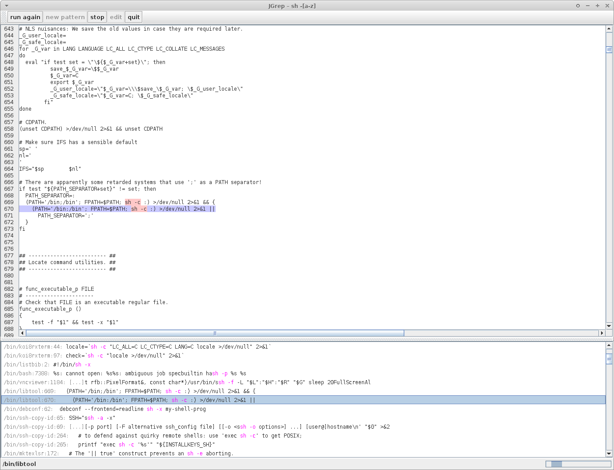

# jgrep

A GUI frontend for grep-like regular expression search written in Java:



```
Usage: jgrep [-Fior] [-c=<charset>] [--editor=<editor>] [--include=GLOB]
             [-m=NUM] <regex> [<files>...]
      <regex>               regular expression
      [<files>...]
  -c, --charset=<charset>   Which character set to use
      --editor=<editor>     The GUI text editor to be used for the 'edit'
                              button.
  -F, --fixed               Fixed
  -i, --ignorecase          Do not distinct between upper and lower case
      --include=GLOB        Search only files whose base name matches GLOB
  -m, --max-count=NUM       Stop reading a file after NUM matching lines.
  -o, --only-matching       Print only the matched (non-empty) parts of a
                              matching line, with each such part on a separate
                              output line.
  -r, --recursive           Recurse through subdirectories
```

You can download [the latest release](https://github.com/mattulbrich/jgrep/releases/latest).
Unzip it where you like; it will contain the needed jar files and the startup scripts.

Run `./gradlew installDist` to obtain the files mentioned above in the directory `build/install`.

Run `./gradlew distZip` to generate the zip file needed for a release.

Run `./gradlew shadowJar` to generate a JAR file `build/libs/jgrep-all.jar` which can then
be used to run jgrep using `java -jar jgrep-all.jar`.
